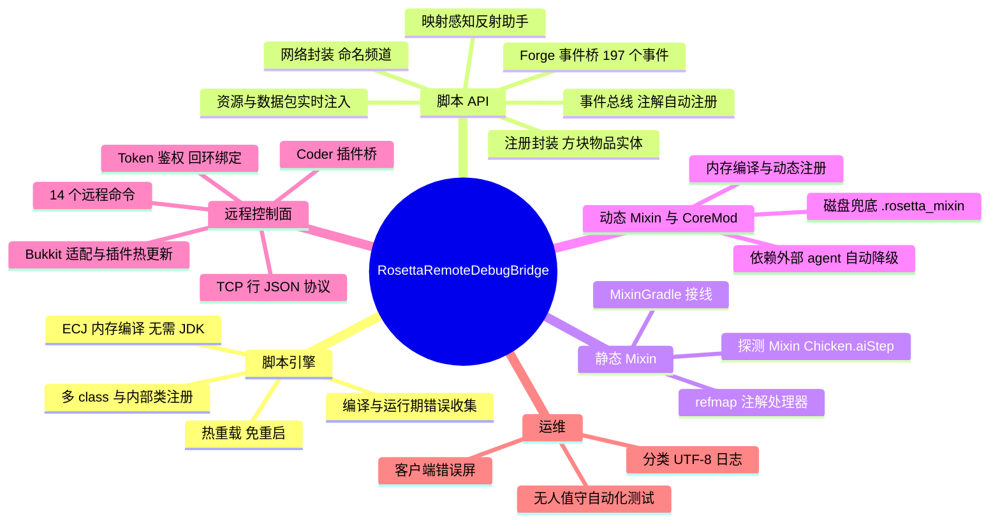
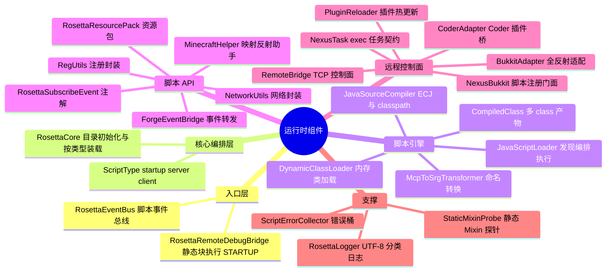
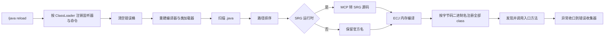
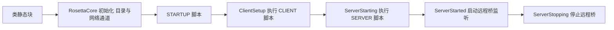
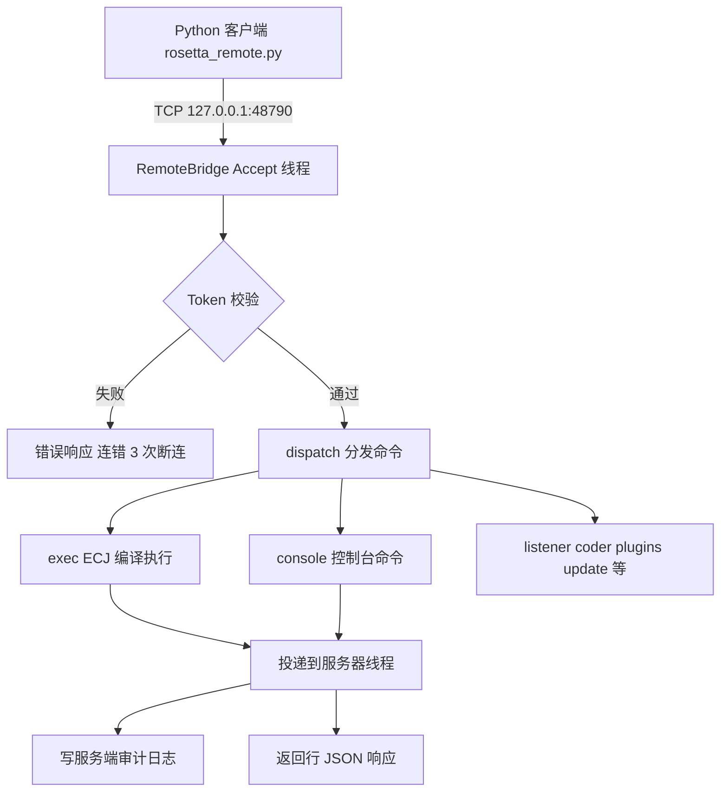
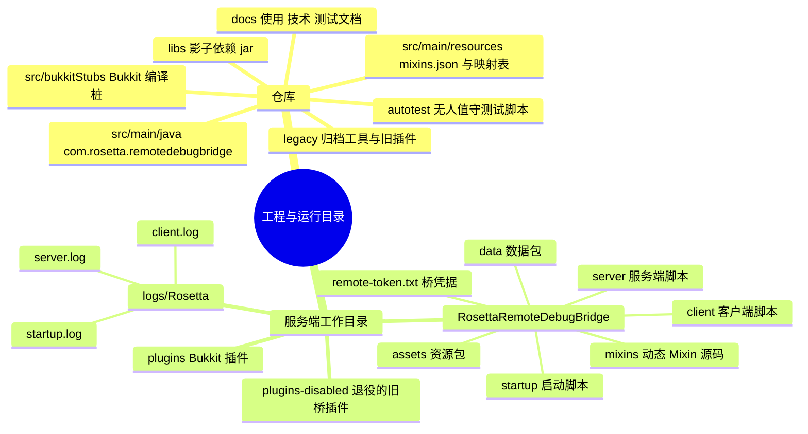

# RosettaRemoteDebugBridge

运行期 Java 脚本引擎 + 远程调试桥 + Mixin 注入的 Minecraft Forge 模组。

| 项 | 值 |
|---|---|
| 游戏 / 加载器 | Minecraft 1.20.1 / Forge 47.x(兼容 Mohist 混合端) |
| Java | 17 |
| 产物 | `rosetta_remote_debug_bridge-1.0.0.jar`(自包含,含 ECJ 编译器) |
| 许可 | MIT(见 `LICENSE.txt`,含第三方组件声明) |
| 文档 | [使用手册](docs/USAGE.md) · [技术手册](docs/ARCHITECTURE.md) · [测试与验收](docs/TESTING.md) |

---

## 这是什么

把普通 `.java` 源码放进游戏目录的 `RosettaRemoteDebugBridge/` 文件夹,模组会在启动 / 开服 /
客户端初始化时**在内存中编译并执行**;无需系统 JDK、无需打包、`/java reload` 即可热重载。
同时提供一个 **TCP 远程控制面**(逐行 JSON 协议),可远程执行 Java、执行控制台命令、
热更新 Bukkit 插件;内置静态 Mixin 注入与 Bukkit/Mohist 适配。

---

## 功能全景



---

## 运行时架构



### 脚本加载与热重载



### 服务器生命周期



### 远程桥请求流程



---

## 目录结构



---

## 快速开始

### 1. 安装

把 `rosetta_remote_debug_bridge-1.0.0.jar` 放入服务端 `mods/`(纯 Forge 或 Mohist 均可)。

### 2. 首次启动

服务端工作目录会生成:

```
RosettaRemoteDebugBridge/
├─ startup/ server/ client/    脚本目录
├─ assets/ data/               资源与数据包
├─ mixins/                     动态 Mixin 源码目录
├─ remote-token.txt            28 字符随机 token
└─ README.txt                  目录说明
logs/Rosetta/{startup,server,client}.log   分类日志
```

启动日志关键行:

```
[INFO] RosettaRemoteDebugBridge initializing...
[INFO] Remote bridge listening on 127.0.0.1:48790 - token auth enforced, loopback-only by default.
```

### 3. 写第一个脚本

`RosettaRemoteDebugBridge/server/Hello.java`:

```java
package rosetta.server;

public class Hello {
    public static void init() {
        System.out.println("Hello from RosettaRemoteDebugBridge!");
    }
}
```

进入世界或执行 `/java reload server` 即可生效。脚本入口方法按
`init → initialize → onLoad → load → register` 顺序查找(可带
`FMLJavaModLoadingContext` 参数)。

### 4. 远程连接

```powershell
python legacy/tools/rosetta_remote.py --port 48790 --token <TOKEN> ping
```

```json
{
  "server": "127.0.0.1:48790",
  "bridge": "rosetta-nexus rosetta_remote_debug_bridge",
  "java": "17.0.18",
  "bukkit": true,
  "players": 0,
  "plugins": 3,
  "running": true
}
```

---

## 配置项(JVM 启动参数)

| 参数 | 默认 | 说明 |
|---|---|---|
| `-Drosetta.remote.port` | `48790` | 桥监听端口 |
| `-Drosetta.remote.bind` | `127.0.0.1` | 绑定地址;`0.0.0.0` 仅限防火墙/SSH 隧道场景 |
| `-Drosetta.remote.token` | token 文件 | 优先于 `RosettaRemoteDebugBridge/remote-token.txt` |
| `-Drosetta.remote.allowPathEscape` | `false` | 允许文件命令逃出服务端工作目录(不建议) |
| `-Drosetta.mixin.annotationProcessors` | `false` | 脚本编译开启 Mixin 注解处理器(ECJ AP) |

修改端口/token 需重启服务端(桥在 `ServerStartedEvent` 启动一次)。

---

## 命令速查

### 游戏内命令(需要 OP / 权限等级 2)

| 命令 | 作用 |
|---|---|
| `/java reload [startup\|server\|client]` | 热重载脚本(不带参数重载全部) |
| `/java errors [startup\|server\|client]` | 查看错误与警告(附日志链接) |
| `/java hand getId` | 显示手持物品注册名(可复制) |
| `/java hand getClass` | 显示手持物品类名 |

### 远程桥命令(TCP + token,完整说明见 [docs/USAGE.md](docs/USAGE.md))

| 类别 | 命令 |
|---|---|
| 基础 | `ping`、`console`、`plugins` |
| 代码执行 | `exec`(ECJ 内存编译)、`reflect`(反射调用) |
| 文件 | `upload`、`read`、`tail`、`ls` |
| 插件 | `enable`、`disable`、`update`(热更新) |
| 集成 | `listener`(status/cleanup/restore)、`coder`(list/api/run) |

---

## 构建与测试

```powershell
# 构建(输出 build/libs/rosetta_remote_debug_bridge-1.0.0.jar)
.\gradlew.bat build

# 开发客户端 / 服务端
.\gradlew.bat runClient
.\gradlew.bat runServer --nogui

# 无人值守自动化测试(自动进世界、执行断言、自动退出)
.\gradlew.bat runClient -PquickPlay=autotest
```

测试详情与验收记录见 [docs/TESTING.md](docs/TESTING.md)。

---

## 安全声明

- 远程桥的 **token 等同于服务器 shell 权限**:`exec` 可执行任意 Java,`console` 可执行任意命令,
  `update` 可热替换插件。切勿泄漏 token(日志、截图、聊天)。
- 默认仅监听回环 `127.0.0.1`;远程访问请使用 SSH 隧道:
  `ssh -L 48790:127.0.0.1:48790 user@server`。
- 脚本目录写入者等价于任意代码执行;请限制 `RosettaRemoteDebugBridge/` 目录权限。
- 调试完成后建议移出 mod jar 并删除 `remote-token.txt`。

---

## 来源与许可

本项目是上游 RainJava 1.0.0 的重构与重命名版本(上游作者 RainMelody / "Rain"),
在原命名空间之外新增了静态 Mixin、Bukkit/Mohist 适配与远程控制面。
项目代码以 **MIT** 许可发布,详见 [`LICENSE.txt`](LICENSE.txt);
随包分发的 ECJ(EPL-2.0)、Mixin(MIT)、JavaParser(Apache-2.0)以重定位形式提供,
许可证与归属见同文件第三方声明。

归档内容:`legacy/remote-bridge`(退役的旧 RosettaRemote 插件源码)、
`legacy/tools/rosetta_remote.py`(当前仍可用的 Python 客户端)、
`legacy/forge-kit` 与 `legacy/portal-probe`(联调用测试插件)。
